# Introduction 
The Maximo Zebra Printing extension adds the ability to define Zebra labels and printers to support printing labels from the Item Master, Inventory and Receipts applications. Labels are defined using Zebra Programming Language (ZPL) [https://en.wikipedia.org/wiki/Zebra_Programming_Language](https://en.wikipedia.org/wiki/Zebra_Programming_Language) and matched to printers by the defined specified media type. Printers must be attached to the network and accessible to the Maximo instance either by network host name or IP address.

# Install
## Maximo 7.6.1.x
To install the Maximo Zebra Printing extension for Maximo 7.6.1.x perform the following steps.
1. Download `zebra-label-x.y.z.tar.gz` or `zebra-label-x.y.z.zip` from the project Release page.
2. Unzip the archive to the [SMP_HOME]/maximo directory, for example `/opt/IBM/SMP/maximo` (unix) or `C:\IBM\SMP\maximo` (windows).
3. Stop the Maximo application server in WebSphere.
4. Open a terminal as root or using sudo (unix) or as Administrator (windows) and navigate to [SMP_HOME]/maximo/tools/maximo.
5. Run the `updatedb.sh` (unix) or `updatedb.bat` (windows).
6. Rebuild and redeploy the Maximo EAR file.

## Maximo Application Suite 8 (MAS8)
To deploy to MAS8 access the Suite Navigator as an administrative user and select the Administration icon from the toolbar menu.

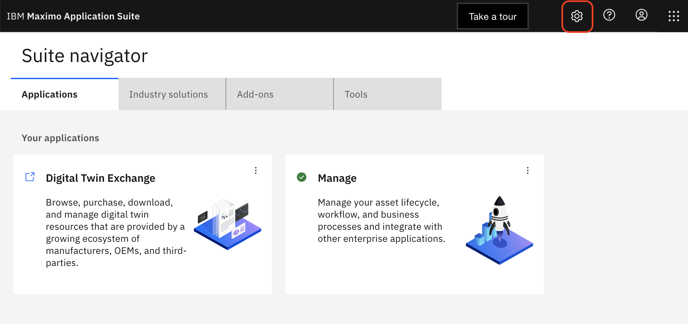

Select the `Catalog` navigation tile.

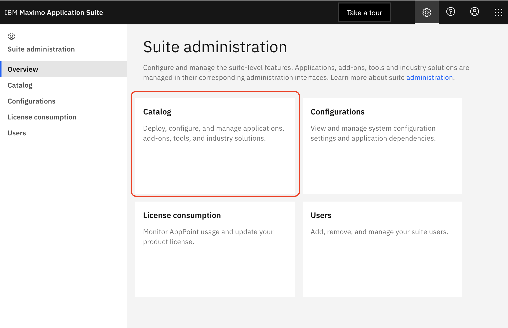

Select the `Manage` navigation tile.


From the `Actions` menu select the `Update configuration` menu item.

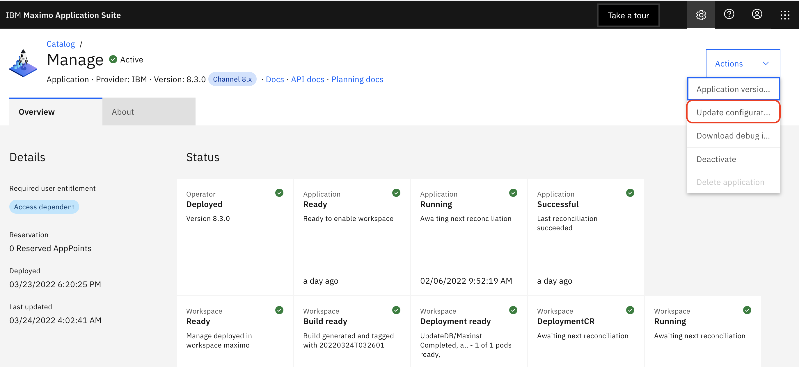

From the list of `Activation configurations` select the `Customization` entry by clicking the pencil icon in the entry row.


If checked, uncheck the `System managed` switch for the `Customization` section.

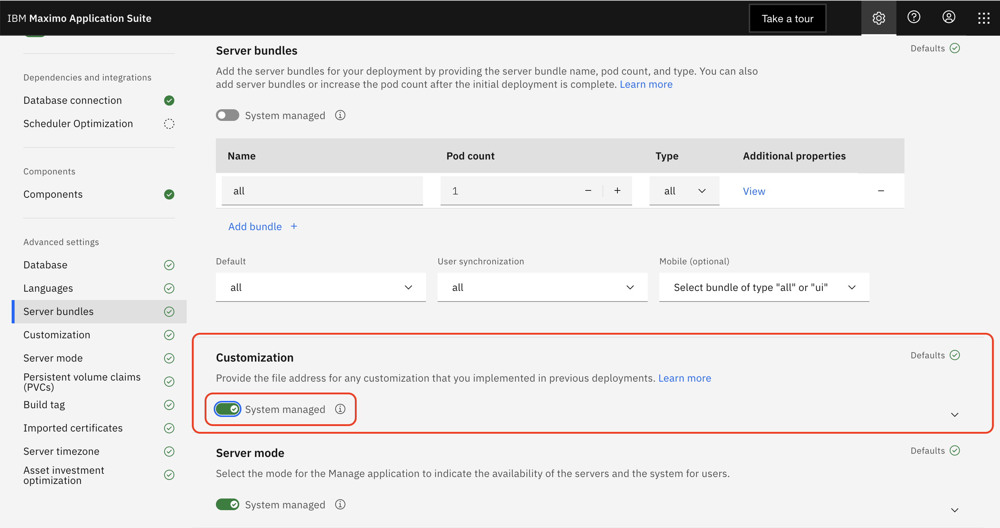

In the `File Address` field enter the URL for the `zebra-label-x.y.z.zip` archive.  This can be hosted on a self-hosted server or from the GitHub release URL, such as `https://github.com/sharptree/zerba-label/archive/refs/tags/v1.0.0.zip`.  If using a self-hosted site, optional credentials can be provided by entering the username and password in the following format.
```properties
user=your user name
password=your password
```

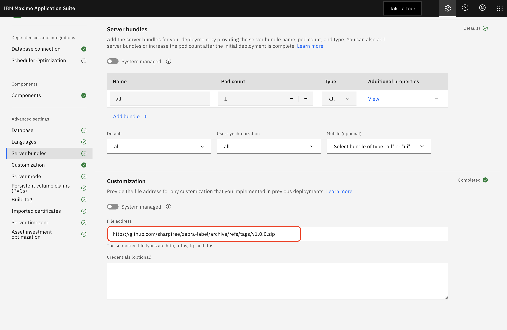

Click the `Apply changes` button at the top of the page to apply the changes.

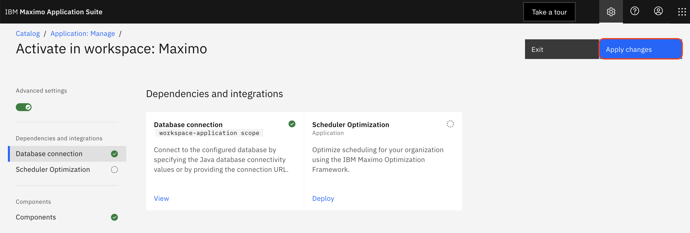

Finally click the `Activate` button to activate the changes. This will trigger a rebuild of the Maximo images and will cause a brief window of downtime as the system changes are applied.

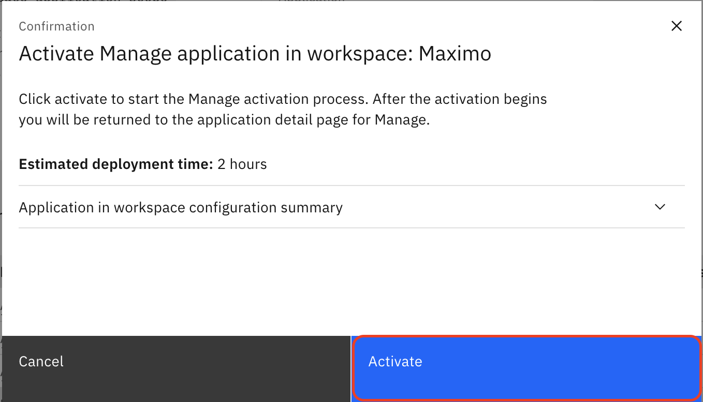

> The Maximo Zebra Printing extension is a customization for MAS8 and is deployed as part of the build and deployment pipeline.  For details on customizations and MAS8 see the IBM documentation in the following links: 
> 
>[https://www.ibm.com/docs/en/maximo-manage/8.3.0?topic=application-adding-customizations](https://www.ibm.com/docs/en/maximo-manage/8.3.0?topic=application-adding-customizations) 
>[https://ibm-mas-manage.github.io/playbook/upgrade/customizationprocess](https://ibm-mas-manage.github.io/playbook/upgrade/customizationprocess) 
# Uninstall
Sharptree believes that trying new things should be as painless as possible, so we also provide scripts to uninstall the Zebra Printing extension and make it as simple as the installation.

To uninstall the Maximo Zebra Printing extension perform the following steps.
1. Stop the Maximo application server in WebSphere.
2. Open a terminal as root or using sudo (unix) or as Administrator (windows) and navigate to [SMP_HOME]/maximo/tools/maximo.
3. Run the `uninstall-zebralabel.sh` (unix) or `uninstall-zebralabel.bat` (windows).
4. Rebuild and redeploy the Maximo EAR file.

# Label Configuration Application
After installing the Maximo Zebra Printing extension a new application named `Label Configuration` will be available from the Navigation menu under System Configuration > Platform configuration.
This application is available to the Maximo administrator group (typically MAXADMIN) after installation and can be granted to other groups through the Security Groups application.

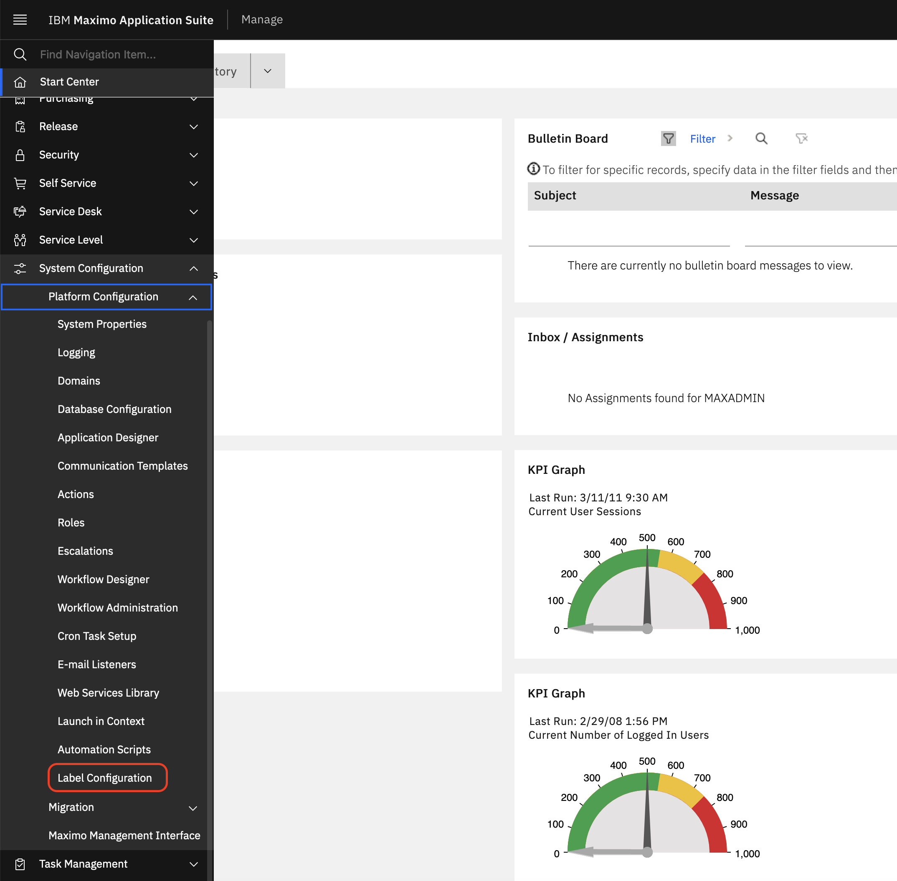

# Configure Printers
Before users can print labels one or more Zebra printers must be configured. Navigate to the `Label Configuration` application and then select the `Manage Printers` option from the `More Actions` menu.


Click the `New Row` button to create a new printer configuration.

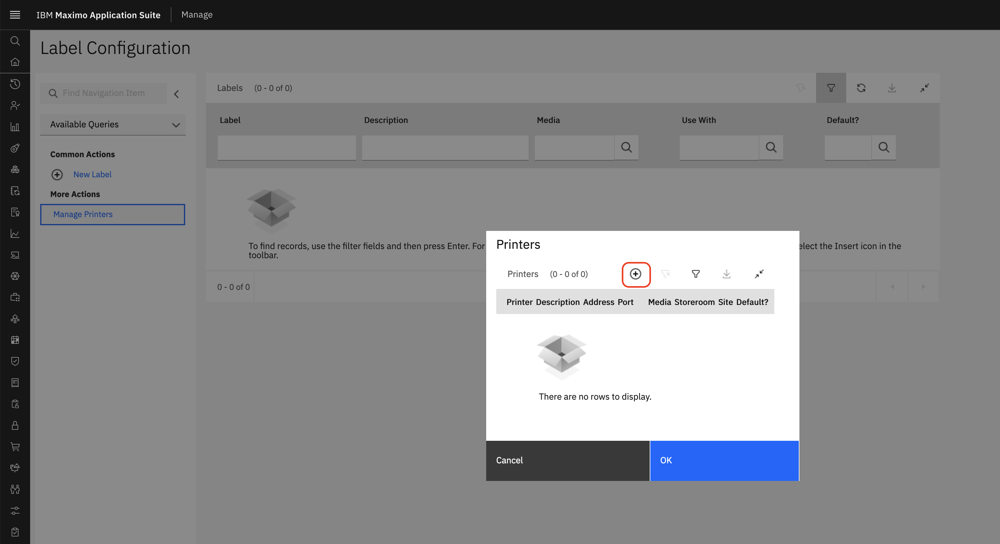

Enter the printer details with a unique printer name globally identifying the printer, a Storeroom, a host name or IP address, port number and  the media type.  When printing the available printers are filtered based on the current records LOCATION or TOSTORELOC value and available labels are filtered based on compatible media types.


Continue to add additional printers as required, then click the `OK` button to save the printer configuration.

## Printer Attributes
| Attribute   | Description                                                                                                              |
|:------------|:-------------------------------------------------------------------------------------------------------------------------|
| Printer     | The unique identifier for the printer.                                                                                   |
| Description | A description of the printer.                                                                                            |
| Address     | The network host name or IP address of the printer.                                                                      |
| Port        | The port that the printer is listening on, a value between 0-65535 , defaults to 9100, which is the Zebra default port.  |
| Storeroom   | The name of the storeroom location where the printer is located.                                                         |
| Media       | The media identifier, typically in HxW (2x1, 4x6 etc) format although non-standard identifiers may be used.              |
| Default?    | Boolean value that indicates that the printer is the default for the storeroom location and will be selected by default. |
| Site        | The Maximo Site identifier for the storeroom location.                                                                   |


# Configure Labels
Click the `New Label` button in the `Common Actions` menu to create a new label. 

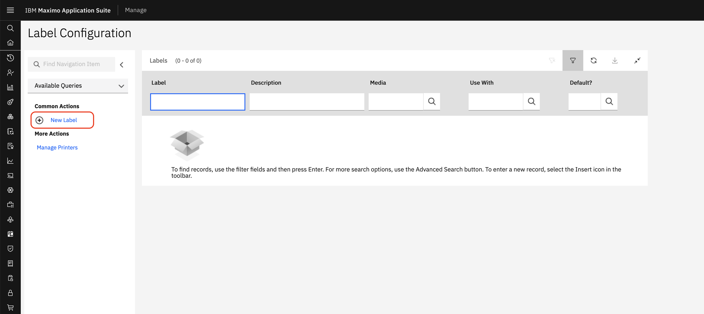

Enter the label detail with a unique Label name that will be used to identifying it when printing, a Description, Media, Use With and the ZPL.  The Use With identifies the object that the label can be used with, either INVBALANCES, INVENTORY or MATRECTRANS.  This is used to perform bind variable replacement within the ZPL definition when the label is printed.  For example, to print the item number in the label, using the INVBALANCES object, `:ITEMNUM` and be included in the label definition and this will be replaced with the current item number from the INVBALANCES record.  This also supports relationships such as using `INVENTORY.DESCRIPTION` from the INVBALANCES object to get the current inventory record item description.

| Attribute   | Description                                                                                                                                                                 |
|:------------|:----------------------------------------------------------------------------------------------------------------------------------------------------------------------------|
| Label       | The unique identifier for the label.                                                                                                                                        |
| Description | A description of the label.                                                                                                                                                 |
| Media       | The media identifier, typically in HxW (2x1, 4x6 etc) format although non-standard identifiers may be used.                                                                 |
| Default     | Value that indicates that the label is the default for the usewith and media combination.                                                                                   |
| Use With    | The Maximo object that the label can be used with.  INVBALANCES, INVENTORY and MATRECTRANS are supported.                                                                   |
| ZPL         | The ZPL definition for the label. The ZPL can contain Maximo bind variables (:ATTRIBUTE), such as :ITEMNUM that will be replaced with the values from the provided record.  |


##ZPL
The Zebra Programming Language (ZPL) is a page description language from Zebra Technologies, used primarily for labeling applications. It consists of commands starting with a caret `^` or tilde `~` character followed by the command.  There are over 170 commands that provide remarkable flexibility for defining labels. A full description of ZPL is beyond the scope of this document, but there are many resources available to learn and generate ZPL.

>A full reference for the ZPL commands can be found here: [https://www.zebra.com/content/dam/zebra/manuals/printers/common/programming/zpl-zbi2-pm-en.pdf](https://www.zebra.com/content/dam/zebra/manuals/printers/common/programming/zpl-zbi2-pm-en.pdf)

###Example
The ZPL below is an example of a simple barcode label that prints the item description and encodes the item number as a barcode.

```zpl
^XA

^FX Description of the item
^CFA,30
^FO50,50^FD:INVENTORY.DESCRIPTION^FS
^FO50,120^GB700,3,3^FS

^FX Section with bar code.
^BY5,2,150
^FO100,170^BC^FD:ITMENUM^FS

^XZ
```
When used with the INVBALANCES record for item number *11453* the following label is printed.


>
>Labelary provides an excellent tool for creating and editing ZPL labels here: [http://labelary.com/viewer.html](http://labelary.com/viewer.html) .

# Print Labels
Once labels and printers have been configured, printing the labels is simple. There are three applications that support barcode printing, Inventory, Item Master, and Receiving. The installation adds a printer icon to the Inventory Balances table in Inventory, to the Storerooms > Storeroom Information table in Item Master and to the Material Receipts table in the Receiving application.

When a user clicks the print button, if a single printer and label combination is available for the current Storeroom (Location in Inventory and Item Master or To Storeroom in Receiving), then the label is printed directly without further user prompting.  If more than one printer or label is available for the current Storeroom location then a dialog is presented allowing the user to select the desired printer and label.  If a printer or label has been marked as `Default` then that printer is selected when the dialog opens.  

The user can optionally select to print more than one label by entering  a `Count` value.  The maximum number of labels that can be printed is 10 by default and can be specified by the `sharptree.zebralabel.maxcount` System Property.

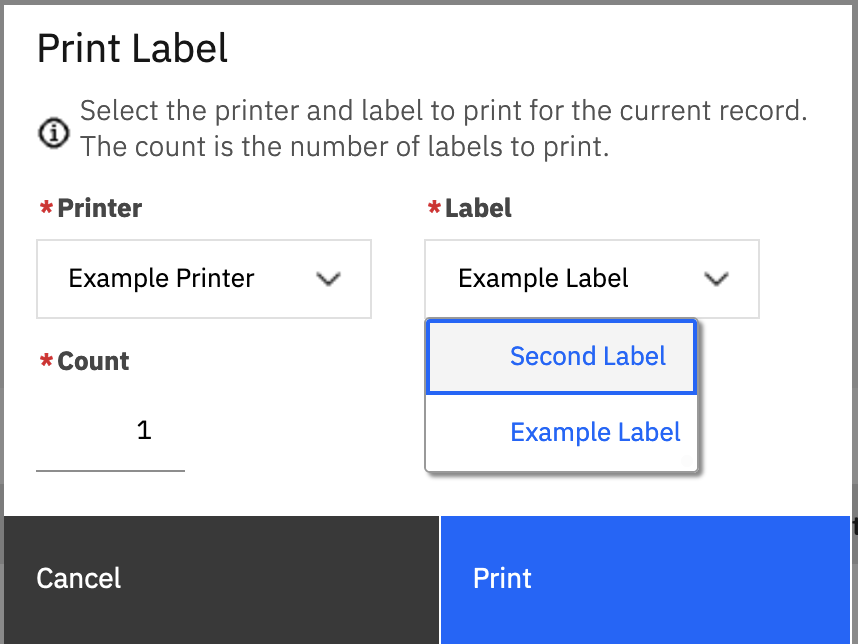
